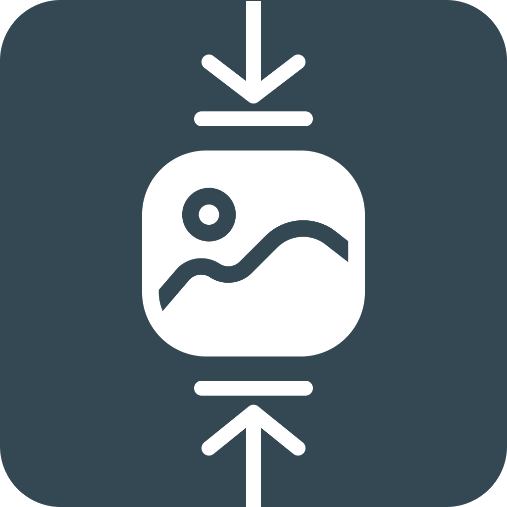

<a id="readme-top"></a>

<!-- PROJECT SHIELDS -->

[![Contributors][contributors-shield]][contributors-url]
[![Forks][forks-shield]][forks-url]
[![Stargazers][stars-shield]][stars-url]
[![Issues][issues-shield]][issues-url]
[![MIT License][license-shield]][license-url]

<!-- PROJECT LOGO -->
<br />
<div align="center">
  <a href="https://github.com/Jemeni11/PhotoLean">
    
  </a>

<h1 align="center">PhotoLean</h1>

<p align="center">
    Optimize your images and save disk space with ease!
    <br />
    <a href="https://github.com/Jemeni11/PhotoLean"><strong>Explore the repo »</strong></a>
  </p>
</div>

## Table of Contents

- [Table of Contents](#table-of-contents)
- [Introduction](#introduction)
- [Features](#features)
- [Installation](#installation)
- [Usage](#usage)
  - [Key Commands](#key-commands)
- [Examples](#examples)
  - [Basic Compression](#basic-compression)
  - [Dry Run](#dry-run)
  - [Watch a Folder](#watch-a-folder)
- [Technical Details](#technical-details)
  - [Supported Image Formats](#supported-image-formats)
  - [Advanced Features](#advanced-features)
  - [CLI UX](#cli-ux)
- [Contributing](#contributing)
- [Wait a minute, who are you?](#wait-a-minute-who-are-you)
- [License](#license)
- [Changelog](#changelog)

## Introduction

PhotoLean is a powerful command-line tool designed to optimize image file sizes and save disk space. With support for multiple image formats and intelligent compression strategies, PhotoLean helps you reclaim storage without compromising image quality.

## Features

- **Image Compression**: Automatically reduce file sizes for ICNS, JPEG, PNG, and WebP formats
- **Dry Run Mode**: Preview compression changes before applying them
- **Folder Monitoring**: Watch specified folders for automatic image optimization
- **Robust File Management**:
  - Prevent unnecessary recompression
  - Comprehensive error handling
  - Background daemon mode support

<p align="right">(<a href="#readme-top">back to top</a>)</p>

## Installation

```sh
pip install PhotoLean
```

<p align="right">(<a href="#readme-top">back to top</a>)</p>

## Usage

PhotoLean provides a comprehensive CLI with various commands for image optimization:

```bash
photolean compress <folder>      # Compress images in a folder
photolean dry-run <folder>       # Simulate compression without modifying files
photolean watch add <folder>     # Add a folder to watch for changes
photolean config show            # View current settings
```

### Key Commands

- `compress`: Compress images with optional interactive mode
- `dry-run`: Preview compression without file modifications
- `watch`: Monitor folders for automatic image optimization
- `config`: Manage tool settings
- `logs`: View and manage operation logs

<p align="right">(<a href="#readme-top">back to top</a>)</p>

## Examples

### Basic Compression

```bash
photolean compress ~/Pictures
```

### Dry Run

```bash
photolean dry-run ~/Downloads
```

### Watch a Folder

```bash
photolean watch add ~/Screenshots
photolean watch start
```

<p align="right">(<a href="#readme-top">back to top</a>)</p>

## Technical Details

### Supported Image Formats

- ICNS
- JPEG
- PNG
- WebP

### Advanced Features

- Concurrent processing option
- Robust file fingerprinting
- Comprehensive error handling
- Daemon mode with system reboot configuration

### CLI UX

- Interactive prompts
- Progress indicators
- Detailed summary reports
- Verbose and quiet output modes

<p align="right">(<a href="#readme-top">back to top</a>)</p>

I was working on a frontend project with a lot of images, and every time I added a new image, I'd have to upload it to an online image compressor, let it compress (while dealing with upload limits), and then download it back. 

I also had moments where I forgot if I'd already compressed an image, so I'd have to compress everything in the folder just to be sure.

This tool helps me compress on-device, without worrying about privacy (since I'm not uploading anything to anyone's website), doesn't need internet access, and compresses images in place.

Instead of creating a new file like `image_compressed.png`, PhotoLean directly optimizes the original file, maintaining the same filename and location while reducing its file size.

<p align="right">(<a href="#readme-top">back to top</a>)</p>

## Contributing

Contributions are welcome! Help us improve PhotoLean by:

- Reporting issues
- Suggesting enhancements
- Submitting pull requests

Steps to contribute:

1. Fork the project
2. Create your feature branch
3. Commit your changes
4. Push to the branch
5. Open a pull request

<p align="right">(<a href="#readme-top">back to top</a>)</p>

## Wait a minute, who are you?

[PhotoLean](https://github.com/Jemeni11/PhotoLean) was built by Emmanuel Jemeni, a Frontend Developer with a
passion for Python.

You can find me on various platforms:

- [LinkedIn](https://www.linkedin.com/in/emmanuel-jemeni/)
- [GitHub](https://github.com/Jemeni11)
- [Twitter](https://twitter.com/Jemeni11_)
- [BlueSky](https://bsky.app/profile/jemeni11.bsky.social)

If you'd like, you can support me on [GitHub Sponsors](https://github.com/sponsors/Jemeni11/)
or [Buy Me A Coffee](https://www.buymeacoffee.com/jemeni11).

<p align="right">(<a href="#readme-top">back to top</a>)</p>

## License

[MIT License](/LICENSE)

<p align="right">(<a href="#readme-top">back to top</a>)</p>

## Changelog

[Changelog](/CHANGELOG.md)

<p align="right">(<a href="#readme-top">back to top</a>)</p>

[contributors-shield]: https://img.shields.io/github/contributors/Jemeni11/PhotoLean.svg?style=for-the-badge
[contributors-url]: https://github.com/Jemeni11/PhotoLean/graphs/contributors
[forks-shield]: https://img.shields.io/github/forks/Jemeni11/PhotoLean.svg?style=for-the-badge
[forks-url]: https://github.com/Jemeni11/PhotoLean/network/members
[stars-shield]: https://img.shields.io/github/stars/Jemeni11/PhotoLean.svg?style=for-the-badge
[stars-url]: https://github.com/Jemeni11/PhotoLean/stargazers
[issues-shield]: https://img.shields.io/github/issues/Jemeni11/PhotoLean.svg?style=for-the-badge
[issues-url]: https://github.com/Jemeni11/PhotoLean/issues
[license-shield]: https://img.shields.io/github/license/Jemeni11/PhotoLean.svg?style=for-the-badge
[license-url]: https://github.com/Jemeni11/PhotoLean/blob/main/LICENSE
